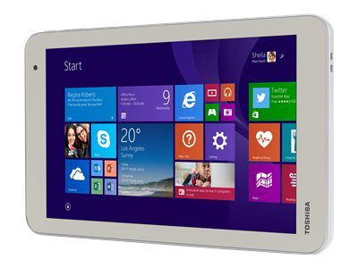

# [Android-x86](https://www.android-x86.org) on the [Toshiba Encore 2 WT8-B](https://www.toshiba.ca/productdetailpage.aspx?id=2147499291)

This repository contains kernel patches, scripts and more that I've utilized to get Android-x86 running on a Toshiba Encore 2 [WT8-B] tablet.

Based off [Kernel 4.19](https://osdn.net/projects/android-x86/scm/git/kernel/tree/kernel-4.19/)

To build from source, follow the instructions at [Android-x86.org](https://www.android-x86.org/source.html)

## Select a build for more info:

## [Android-x86-8.1r2](./Android-x86-8.1r5) -- release build _now available!_
## [Android-x86-9.0r2](./Android-x86-9.0r2) -- under development, more info soon
